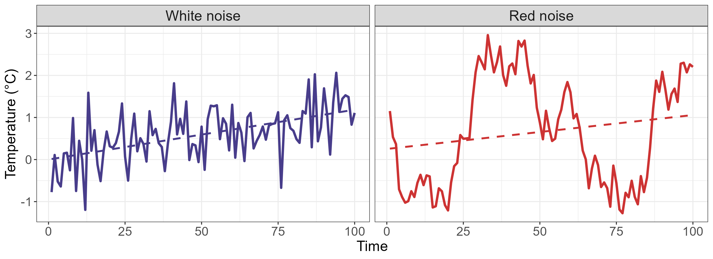
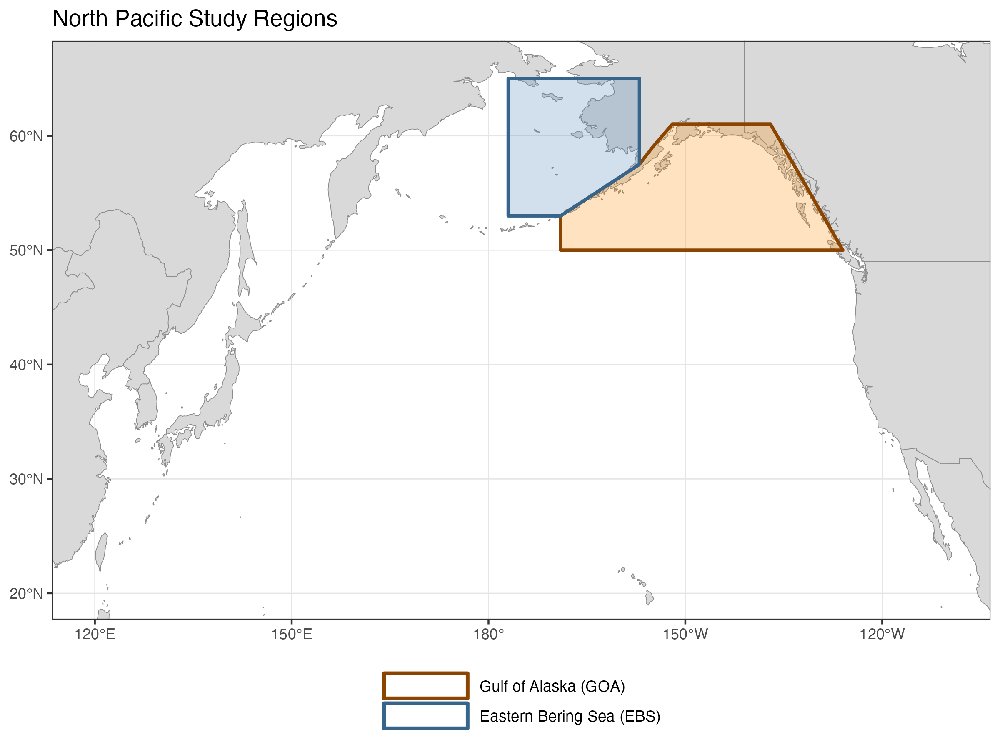
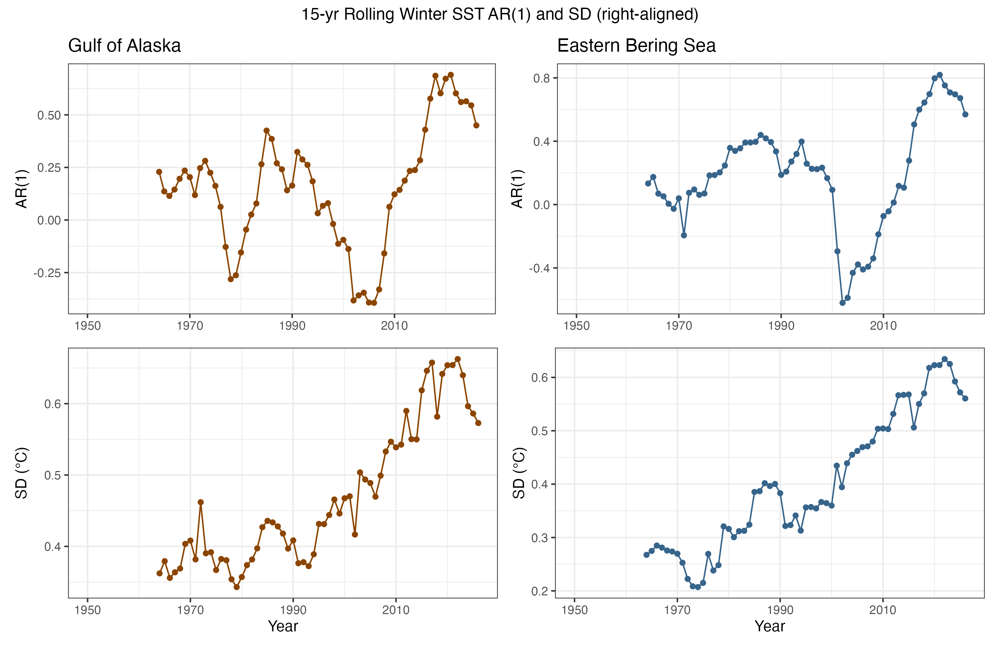
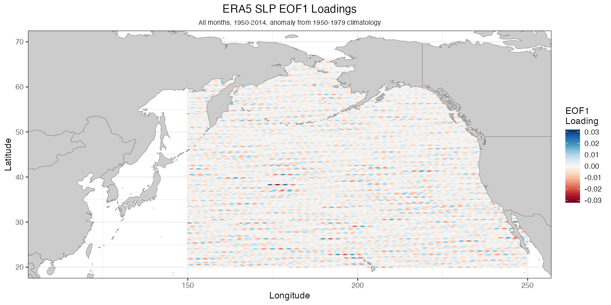
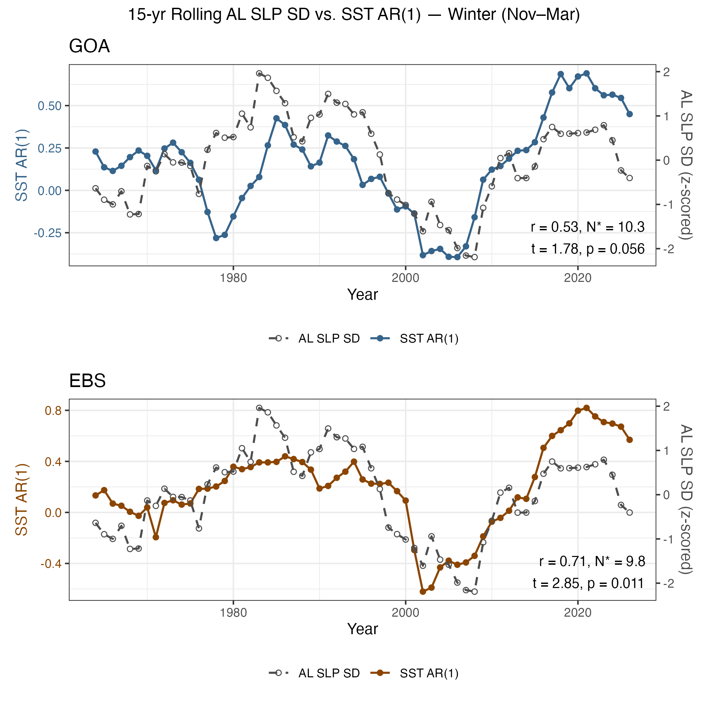
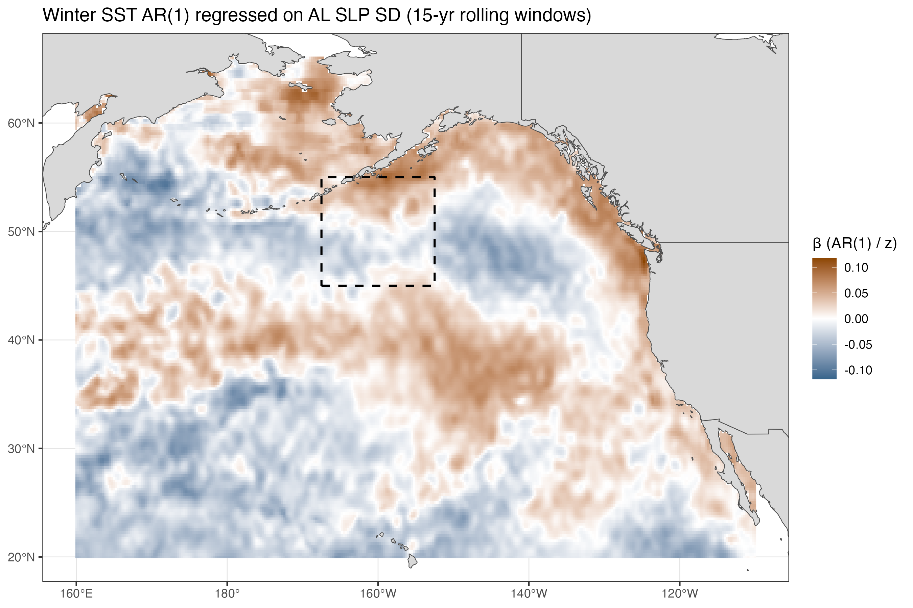
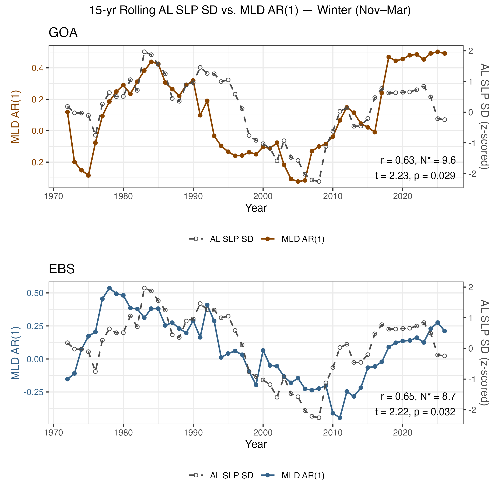
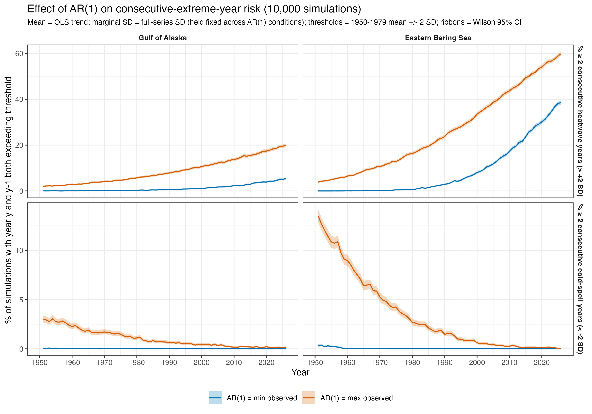

# SST Reddening in the Gulf of Alaska and Eastern Bering Sea — Summary of Findings

*Working summary, June 2026. Analyses in `Scripts/analysis.R`; figures in `Figures/`; tabular
output in `Output/`.*

---

## 1. Motivation and approach

The central question of this project is whether North Pacific sea surface temperature (SST) has
become **"redder"** — more strongly autocorrelated from year to year — and, if so, what physical
mechanism is driving the change. Reddening matters because it is not just a statistical curiosity:
for a fixed amount of year-to-year variance, increasing the lag-1 autocorrelation (AR(1)) of a time
series increases the chance that anomalies persist across consecutive years. In an ecological
context, that translates into longer marine heatwaves and longer cold spells, which is precisely the
kind of low-frequency forcing that destabilizes groundfish and crab stocks in the Gulf of Alaska
(GOA), Eastern Bering Sea (EBS), and Aleutian Islands.

*The conceptual contrast at the heart of the project: a white-noise series (left) crosses its mean
frequently, while a red-noise series with the same marginal variance (right) wanders, producing
multi-year runs above or below the mean.*

The analysis is built on a consistent, reproducible workflow. SST and sea-level pressure (SLP) come
from **ERA5** (1950–2026), mixed-layer depth (MLD) from the **ORAS5** ocean reanalysis, and the
attribution experiments use the **CESM2 Large Ensemble** in two configurations — the Fully Coupled
Model (FCM) and a Mechanistically Decoupled Model (MDM) in which interannual wind-stress variability
is suppressed. Throughout, anomalies are referenced to a 1950–1979 climatology, expressed as winter
(November–March) means with the year assigned to January, detrended, and summarized with
**right-aligned 15-year rolling windows** for the AR(1) and standard-deviation (SD) diagnostics. The
two core study polygons and the Aleutian Low (AL) SLP box (45–55°N, 192.5–207.5°E, following Litzow
et al. 2020, *PNAS*) are shown below.

*Study domains: the GOA and EBS SST polygons, the Aleutian Low SLP box over which pressure
variability is measured, and the broader EOF analysis domain.*

---

## 2. SST has reddened, and the change is recent

The first robust observational result is that winter SST autocorrelation in both systems has
increased over the record, with the strongest reddening concentrated in the most recent decades
rather than following a smooth linear trend. The 15-year rolling AR(1) and SD series (below) show
relatively stable autocorrelation through the late twentieth century followed by a marked rise in the
2000s–2020s — the windows that include the 2014–2016 "Blob" and the persistent warm anomalies that
followed it. Because the AR(1) increase is not accompanied by a proportional collapse in variance,
the reddening reflects a genuine change in temporal structure, not simply a change in amplitude.

*15-year right-aligned rolling AR(1) and SD of winter SST anomalies for the EBS, GOA, and the full
North Pacific domain. Reddening (rising AR(1)) is pronounced in the terminal windows.*

Because the temporal signature is a late-rising hump rather than a straight line, all downstream
significance testing was deliberately moved away from linear-trend tests toward methods that respect
the actual shape of the curve — high-EDF GAMs for the model comparison, and randomization /
modified-Chelton tests for the driver-response correlations. This was an important methodological
correction: an early linear-trend version of the CESM attribution test found "no difference" largely
because it was testing for the wrong pattern.

---

## 3. The Aleutian Low is the leading candidate driver

The working hypothesis is that **reddening in SST is forced by decadal variability in the strength
and variance of the Aleutian Low.** The leading EOF of detrended monthly North Pacific SLP recovers
the expected Aleutian Low center of action, and its loadings peak squarely inside the pre-registered
AL box — confirming that the box-mean SLP series is a faithful index of AL variability.

*Leading EOF of winter North Pacific SLP. The center of action coincides with the Aleutian Low box,
validating the box-mean index used throughout the driver-response analysis.*

The headline driver-response result is the relationship between the 15-year rolling **SD of AL SLP**
(a measure of how *volatile* the atmospheric forcing is) and the 15-year rolling **AR(1) of SST**.
Plotted on dual axes, the two series track each other closely in both systems: decades of high
atmospheric volatility coincide with decades of strongly reddened SST.

*15-year rolling AL SLP SD (dashed, gray) against SST AR(1) (solid) for the GOA (top) and EBS
(bottom). Significance is assessed with the modified-Chelton effective-sample-size correction and a
one-sided randomization test (1,000 `arima.sim` surrogate pairs matched to the SD and AR(1) of the
plotted lines), guarding against the spurious correlation that rolling-window smoothing would
otherwise inflate.*

Spatially, regressing cell-wise SST AR(1) onto the AL SLP SD index produces a coherent, basin-scale
pattern: the strongest positive coefficients sit in the Gulf of Alaska and along the North American
shelf, with the opposite sign in the central/subtropical Pacific — a footprint that resembles the
Pacific Decadal Oscillation (PDO) dipole. This is the spatial fingerprint we would expect if a more
variable Aleutian Low were driving the reddening through ocean-atmosphere coupling.

*Cell-wise regression of 15-year rolling SST AR(1) on AL SLP SD (GLS with AR(1) residuals; contours
mark Benjamini–Hochberg FDR q ≤ 0.05). The PDO-like dipole, strongest in the NE Pacific, is the
spatial signature of Aleutian Low forcing.*

---

## 4. A mixed-layer-depth pathway

A natural mechanism linking AL volatility to SST reddening is the **mixed layer**: a more variable
wind field modulates mixed-layer depth, and a deeper, more variable mixed layer increases the thermal
inertia (memory) of the upper ocean, which would raise SST AR(1). The area-aggregated evidence for
this pathway is encouraging. Repeating the dual-axis diagnostic with the 15-year rolling AR(1) of
ORAS5 mixed-layer depth in place of SST AR(1) shows that upper-ocean memory tracks Aleutian Low
volatility closely in both systems, with a significant positive correlation (GOA *r* = 0.63,
*p* = 0.029; EBS *r* = 0.65, *p* = 0.032, modified-Chelton effective sample size).

*15-year rolling AL SLP SD (dashed, gray) against MLD AR(1) (solid) for the GOA (top) and EBS
(bottom). Both systems show a significant positive relationship, consistent with a more variable
Aleutian Low deepening and destabilizing the mixed layer and thereby lengthening upper-ocean memory.*

The spatial picture is more equivocal. A cell-wise regression of MLD AR(1) on AL SLP SD shows only a
faint PDO-like dipole in the NE Pacific that is **spatially patchy and rarely significant at the
individual-cell level**, even after aggregation to 1° and 2° blocks and FDR control. The mixed layer
is therefore plausibly part of the pathway — the area-mean relationship is real and significant — but
the cell-level reanalysis is too noisy to localize it cleanly, and some of the ocean memory may also
arise from mechanisms beyond MLD (e.g., re-emergence). This remains the least-resolved link in the
mechanistic chain.

---

## 5. The CESM2 attribution experiment is, so far, a null result

The most rigorous attribution test available is the FCM-vs-MDM contrast: if interannual wind-stress
variability is *required* to produce the observed reddening, then the FCM ensemble (which has it)
should reproduce the AL-SD↔SST-AR(1) relationship and the MDM ensemble (which does not) should not.
After carefully verifying — via three independent ID-matching tests (T1–T3) — that SST and SLP output
from the *same* ensemble member could be paired, the per-member correlation between AL SLP SD and SST
AR(1) was computed for all members of both ensembles.

The per-member correlation distributions are centered near zero and essentially **identical** between FCM and MDM (mean
member r ≈ 0.03 for FCM GOA/EBS; ≈ −0.04 to 0.03 for MDM), and the GAM-EDF test for a reddening
trajectory does not separate the two ensembles either. In other words, **CESM2 does not reproduce the
strong AL-driven reddening seen in observations, and turning off wind variability changes nothing.**
This is a genuine tension in the project. The most likely explanations are (a) the observed
relationship is partly a product of the short, single realization of the real world (decadal sampling
limits), or (b) the coupling mechanism is underrepresented in CESM2. The cell-wise regression maps
for FCM and MDM confirm the same conclusion: model relationships are far weaker than observed and
require a separate, compressed color scale to be visible at all. For now the CESM2 line of evidence
is treated as inconclusive, and the weight of the argument rests on the observational analysis.

---

## 6. Strong seasonal sensitivity, consistent with a lagged ocean response

A seasonal sensitivity test motivated by Newman et al. (2016, *J. Climate*) produced one of the more
interesting refinements. Repeating the dual-axis analysis with **early-winter (NDJ) AL SLP SD** as
the forcing and **late-winter (FMA) SST AR(1)** as the response — to capture the documented 1–3 month
lag of the ocean's response to atmospheric forcing — changes the picture substantially.

Independent checks (Section 14 of `analysis.R`, verified 2026-04-28) confirmed this is a real
seasonal structure, not a coding artifact. Decadal AL volatility decomposes into nearly orthogonal
early- and late-winter modes: the canonical NDJFM SLP-SD signal is driven mainly by **late winter**
(NDJFM vs. FMA, r = 0.70), while early- and late-winter volatility are actually *anti-correlated* at
the decadal scale (NDJ vs. FMA, r = −0.57). The practical implication is that the choice of season is
not a minor tuning knob — the NDJ-forcing/FMA-response configuration tests genuinely independent
information from the all-winter analysis, and any final mechanistic story has to specify *which* part
of the winter is doing the work.

---

## 7. Why it matters: reddening raises the risk of multi-year extremes

The final section ties the statistics back to ecological consequence. Holding each system's long-term
warming trend and marginal variance *fixed*, winter SST was simulated (10,000 runs) under three
autocorrelation conditions — the minimum observed AR(1), zero, and the maximum observed AR(1) — and
the frequency of **consecutive (≥2-year) exceedances** beyond ±2 SD of the 1950–1979 climatology was
tabulated.

*Simulated percentage of years that are the second of ≥2 consecutive heatwave (or cold-spell) years,
for the GOA and EBS, under minimum vs. maximum observed AR(1). Marginal variance is held constant, so
the difference isolates the effect of autocorrelation alone.*

The key point is mechanistic clarity: because marginal variance is held constant, AR(1) does **not**
change the chance of any single year being extreme — but it sharply increases the chance of *back-to-
back* extreme years. The reddening documented in Sections 2–3 therefore has a direct, quantifiable
cost in terms of prolonged heatwaves and cold spells, which is exactly the persistence that stresses
fish and crab populations.

---

## 8. Where things stand

**Established:** (1) Winter SST in the GOA and EBS has reddened, with the signal concentrated in
recent decades; (2) the reddening covaries strongly with decadal variability in Aleutian Low SLP and
produces a PDO-like spatial fingerprint; (3) the effect is strongly seasonal, consistent with a
lagged ocean response; (4) increased AR(1) materially raises the risk of multi-year temperature
extremes.

**Unresolved:** (1) the CESM2 FCM/MDM experiment does not reproduce the observed relationship, leaving
formal attribution open; (2) the mixed-layer pathway is suggestive but weak and spatially incoherent.

**Natural next steps:** test re-emergence and ocean-memory mechanisms beyond MLD; reconcile the
observation-model gap (sampling vs. model deficiency); and connect the reddening diagnostics directly
to stock-recruitment and stability metrics for the target groundfish and crab stocks.
